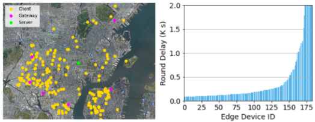
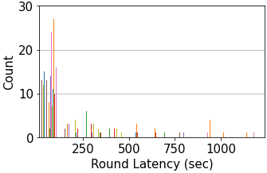

# Async-HFL: Efficient and Robust Asynchronous Federated Learning in Hierarchical IoT Networks

This repo contains the simulation implementation for paper:

Xiaofan Yu, Ludmila Cherkasova, Harsh Vardhan, Quanling Zhao, Emily Ekaireb, Xiyuan Zhang, Arya Mazumdar, Tajana Rosing. "Async-HFL: Efficient and Robust Asynchronous Federated Learning in Hierarchical IoT Networks" in the Proceedings of IoTDI 2023.

 [[arXiv link]](https://arxiv.org/abs/2301.06646)

## File Structure

The implementation is based on [FLSim](https://github.com/iQua/flsim) and [ns3-fl](https://github.com/eekaireb/ns3-fl).

```
.
├── client.py          // Implementation of client class
├── config.py          // Implementation of argument parsing and configuration settings
├── configs            // The json configuration files for all datasets and test scenarios (iid vs non-iid, sync vs async)
├── delays             // Delays generated by ns3-fl and the script to generate computational delays
├── LICENSE
├── load_data.py       // Implementation of data loaders for both image datasets and the LEAF dataset
├── models             // Implementation of ML models for all datasets
├── README.md          // This file
├── requirements.txt   // Prerequisites
├── run.py             // Main script to fire simulations
├── scripts            // Collection of bash scripts for various experiments in the paper
├── server             // Implementation of servers (sync, semi-async, async)
└── utils              // Necessary util files in FLSim
```

## Prerequisites

We test with Python3.7. We recommend using conda environments:

```bash
conda create --name asynchfl-py37 python=3.7
conda activate asynchfl-py37
python -m pip install -r requirements.txt
```

All require Python packages are included in `requirements.txt` and can be installed automatically.

Async-HFL uses [Gurobi](https://www.gurobi.com/) to solve the gateway-level device selection and cloud-level device-gateway association problem. A license is required. After the installation, add the following lines to the bash initialization file (e.g., `~/.bashrc`):

```bash
export GUROBI_HOME="PATH-TO-GUROBI-INSTALLATION"
export PATH="${PATH}:${GUROBI_HOME}/bin"
export LD_LIBRARY_PATH="${LD_LIBRARY_PATH}:${GUROBI_HOME}/lib"
```

### Dataset Preparation

As mentioned in the paper, we experiment on MNIST, FashionMNIST, CIFAR-10, Shakespeare, HAR, HPWREN.

* For MNIST, FashionMNIST, CIFAR-10, the script will download the datasets automatically into `./data` folder, which is specified in the json configuration files under `./configs`. The non-iid partition for each client is done synthetically, assigning two random classes to each client, as set in the json configuration.

* The Shakespeare dataset is adapted from the [LEAF](https://github.com/TalwalkarLab/leaf) dataset, and we use their original script for natural data partition:

  ```
  git clone https://github.com/TalwalkarLab/leaf.git
  cd leaf/data/shakespeare/
  ./preprocess.sh -s niid --sf 0.2 -k 0 -t sample -tf 0.8
  ```

  The `preprocess.sh` script generates partitioned data in the same directory. Then, you need to specify the path to the Shakespeare data in `./configs/Shakespeare/xxx.json`, where `xxx` corresponds to the setting.

* The HAR dataset is downloaded from [UCI Machine Learning repository](https://archive.ics.uci.edu/ml/datasets/human+activity+recognition+using+smartphones). We provide a similar partition script as in LEAF [here](https://github.com/UCSD-SEELab/iot-dataset/tree/main/har). Similarly, after partition, you need to specify the path to the partitioned data in `./configs/HAR/xxx.json`.

* The HPWREN dataset is constructed from the historical data of [HPWREN](https://hpwren.ucsd.edu/). We provide the data download script and partition scripts [here](https://github.com/UCSD-SEELab/iot-dataset/tree/main/hpwren). You need to specify the path to the partitioned data in `./configs/HPWREN/xxx.json`.

Note, that Shakespeare, HAR and HPWREN use natural non-iid data partition as detailed in the paper.

### Delay Generation

One major novelty of Async-HFL is considering the networking heterogeneity in FL. Specifically, we generate communication delays from [ns3-fl](https://github.com/eekaireb/ns3-fl), and the computational delay randomly from a log-normal distribution. 

* For the communication delays, the hierarchical network topology is configured based on [NYCMesh](https://www.nycmesh.net/) with 184 edge devices, 6 gateways, and 1 server. We assume that edge devices are connected to the gateways via Wi-Fi, and the gateways are connected to the server via Ethernet. For each node, we retrieve its latitude, longitude, and height as input to the `HybridBuildingsPropagationLossModel` in ns-3 to obtain the average point-to-point latency. The  communication delays generated from [ns3-fl](https://github.com/eekaireb/ns3-fl) are stored in `delays/delay_client_to_gateway.csv` and `delays/delay_gateway_to_cloud.csv`.
* For the computational delays, we run `python3 delays/generate.py`.

The path to the corresponding delay files are set in the json configuration files.

The NYCMesh topology and round delay distributions are shown as follows.



## Getting Started

To run synchronous FL on MNIST with non-iid data partition and random client selection:

```bash
python run.py --config=configs/MNIST/sync_noniid.json --delay_mode=nycmesh --selection=random
```

For synchronous FL, apart from random client selection, we offer the other client-selection strategies:

* `divfl`: Implementation of DivFL in [Diverse Client Selection for Federated Learning via Submodular Maximization](https://openreview.net/forum?id=nwKXyFvaUm), ICLR'21
* `tier`: Implementation of TiFL in [TiFL: A Tier-based Federated Learning System](https://dl.acm.org/doi/abs/10.1145/3369583.3392686), HPDC'20
* `oort`: Implementation of Oort in [Oort: Efficient Federated Learning via Guided Participant Selection](https://www.usenix.org/conference/osdi21/presentation/lai), OSDI'21

To run RFL-HA (sync aggregation at gateways and async aggregation at cloud) on FashionMNIST with non-iid data partition and random client selection:

```bash
python run.py --config=configs/FashionMNIST/rflha_noniid.json --delay_mode=nycmesh --selection=random
```

* `rflha`: Implementation of RFL-HA in [Resource-Efficient Federated Learning with Hierarchical Aggregation in Edge Computing](https://ieeexplore.ieee.org/document/9488756), INFOCOM'21

To run semi-asynchronous FL on CIFAR-10 with non-iid data partition and random client selection:

```bash
python run.py --config=configs/CIFAR-10/semiasync_noniid.json --delay_mode=nycmesh --selection=random
```

* `semiasync`: We implement the semi-async FL strategy as in [Federated Learning with Buffered Asynchronous Aggregation](https://proceedings.mlr.press/v151/nguyen22b/nguyen22b.pdf), AISTATS'22

To run asynchronous FL on Shakespeare with non-iid data partition and random client selection:

```bash
python run.py --config=configs/Shakespeare/async_noniid.json --delay_mode=nycmesh --selection=random
```

To run Async-HFL on HAR with non-iid data partition:

```bash
python3.7 run.py --config=configs/HAR/async_noniid.json --delay_mode=nycmesh --selection=coreset_v1 --association=gurobi_v1
```

To run Async-HFL on HPWREN with non-iid data partition, and certain `alpha` (weight for delays in gateway-level client selection, used in `server/clientSelection.py`) and `phi` (weight for throughput in cloud-level device-gateway association, used in `server/clientAssociation.py`):

```bash
python3.7 run.py --config=configs/HAR/async_noniid.json --delay_mode=nycmesh --selection=coreset_v1 --association=gurobi_v1 --cs_alpha=alpha --ca_phi=phi
```

### Scripts

We provide our scripts for running various experiments in the paper in `scripts`:

```
.
├── run_ablation.sh                      // Script for running ablation study on Async-HFL
|                                        // (various combinations of client selection and association)
├── run_baseline_nycmesh.sh              // Script for running baselines in the NYCMesh setup
├── run_baseline.sh                      // Script for running baselines in the random delay setup
├── run_exp_nycmesh.sh                   // Script for running Async-HFL in the NYCMesh setup
├── run_exp.sh                           // Script for running Async-HFL in the random delay setup
├── run_motivation_nycmesh.sh            // Script for running the motivation study
├── run_sensitivity_pca.sh               // Script for running sensitivity study regarding PCA dimension
└── run_sensitivity_phi.sh               // Script for running sensitivity study regarding phi
```

## Physical Deployment

Apart from simulation, we also evaluation Async-HFL with a physical deployment using Raspberry Pis and CPU clusters. The implementation is at https://github.com/Orienfish/FedML, which is adapted from the [FedML](https://github.com/FedML-AI/FedML) framework.

The delay distribution in the physical deployment verifies our strategy in generating the delays in the simulation framework, which presents a long-tail distribution:



The above plot shows a histogram of all round latencies collected when an updated model is returned in our physical deployment, with x axis representing round latency and y axis representing the counts. It can be clearly observed that the majority of trials return fairly quickly, while in rare cases the round latency can be unacceptably long. 

## License

MIT

If you have any questions, please feel free to contact x1yu@ucsd.edu.
